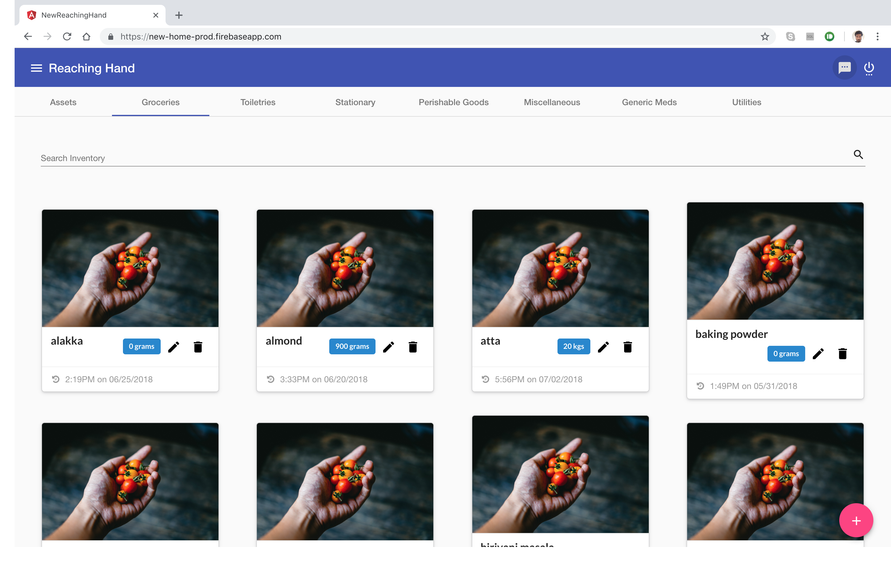
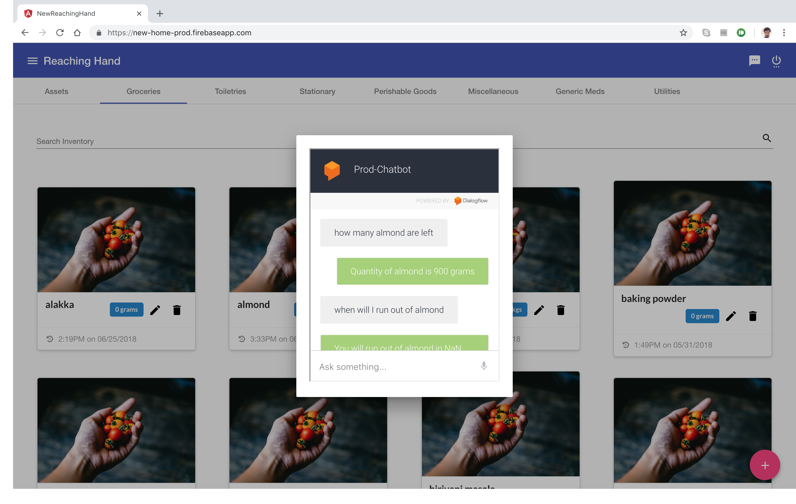
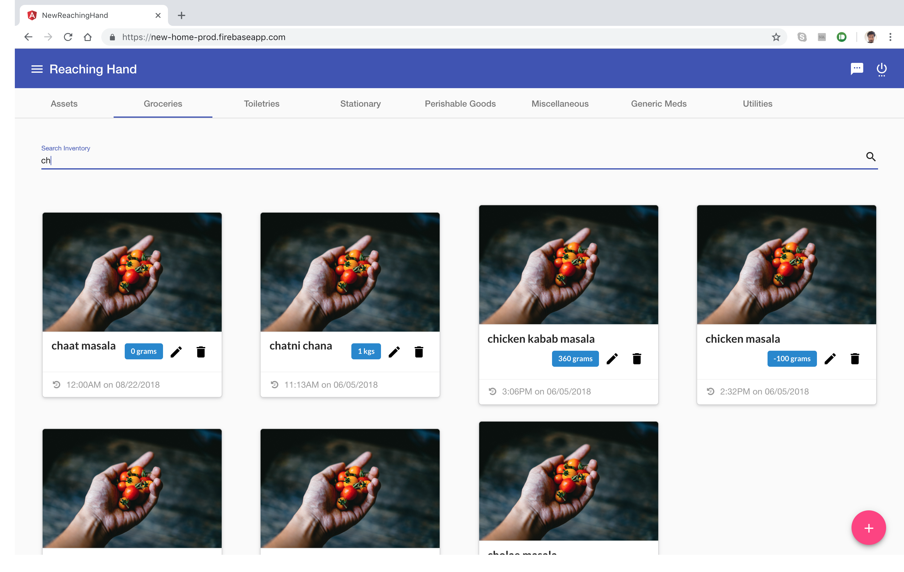
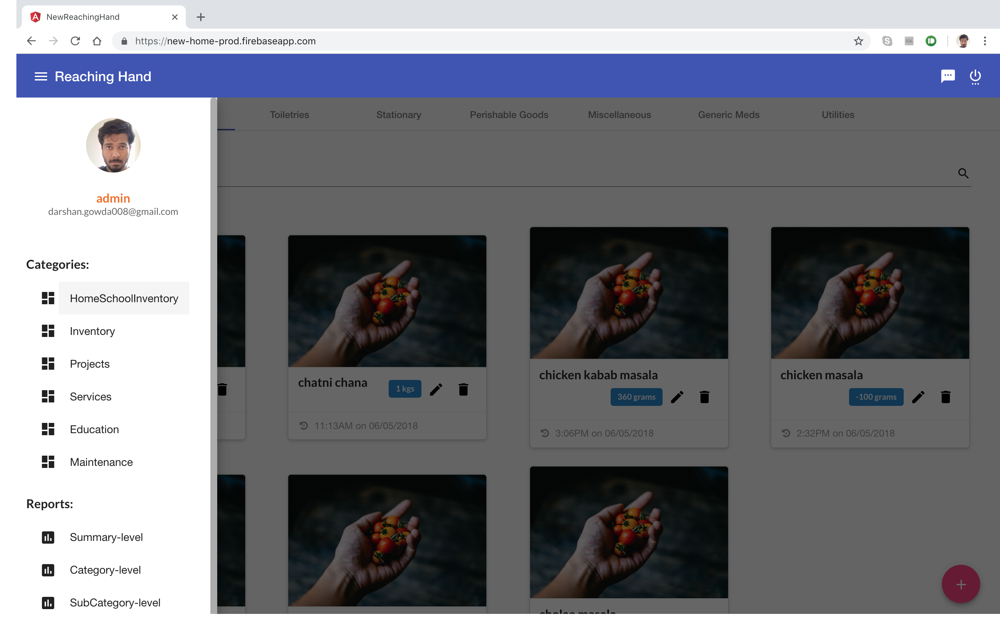
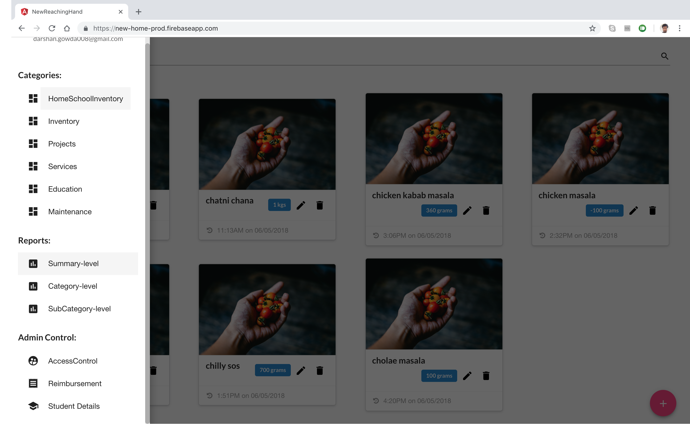
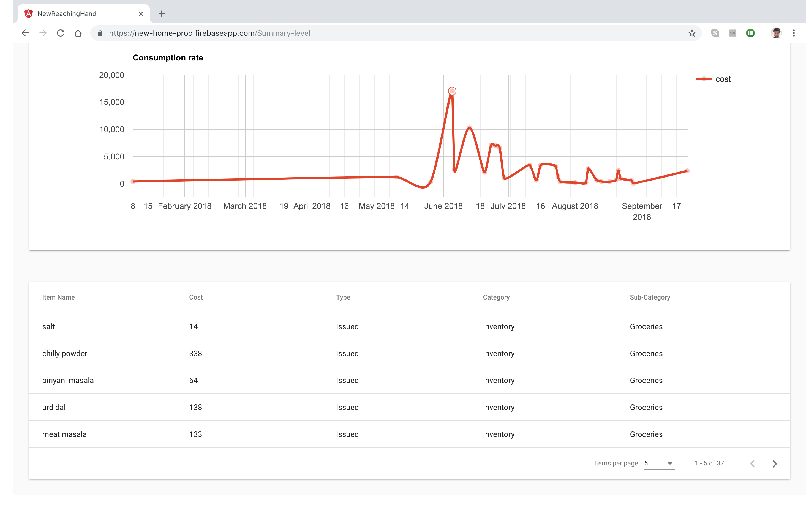
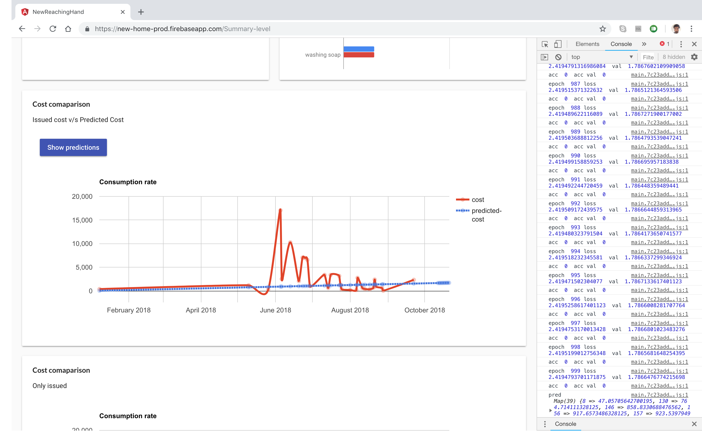
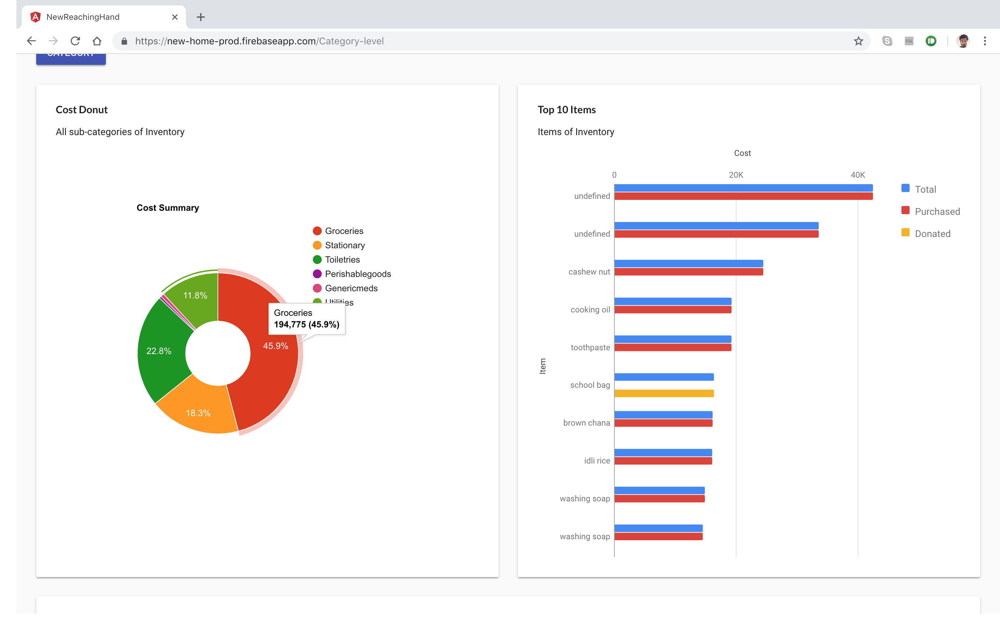
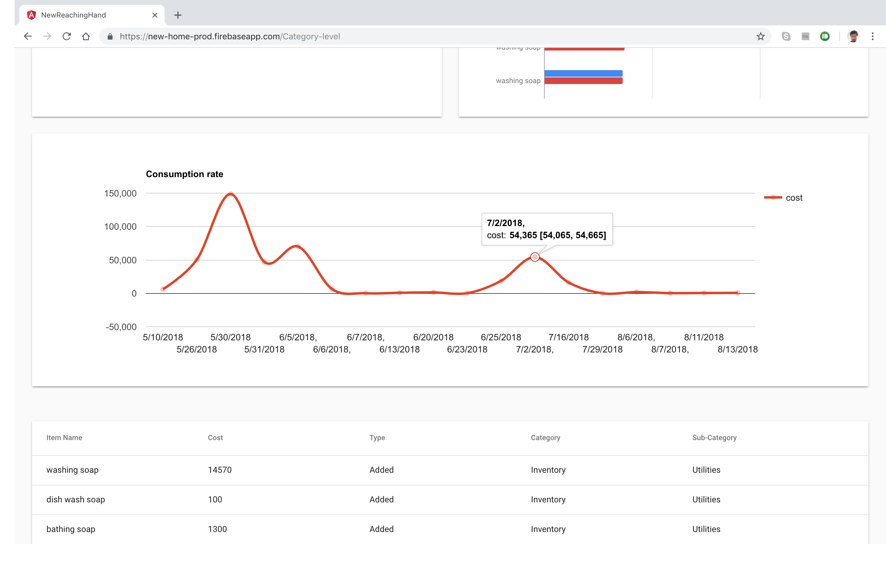

# NewReachingHands

Source code of the custom solution built for the NGO - Reaching Hand. The angular app (PWA) is used as a daily driver by the NGO to fill in their various inventory stocks and get a stock prediction with cost estimation (tensorflow JS) and also a dialogflow chatbot to retrieve and store basic records.

## Highlights

### Angular
<ul>
  <li>Auth Services with Firebase Authentication</li>
  <li>Auth Guards with Angular Routers</li>
  <li>Resolvers for Google Charts</li>
  <li>Services - firebase firestore</li>
</ul>

### Other libraries
<ul>
  <li>Material Angular and Semantic UI</li>
  <li>FCM and Cloud Functions to send push notifications</li>
  <li>Google Carts</li>
  <li>Tensorflow JS - stock prediction (Sequential Linear, non cached & real time, 1000 epochs)</li>
  <li>Dialogflow - chatbot</li>
  <li>Google drive integration - non structured file storage</li>
</ul>

## Demo 
[Video of application in production](https://youtu.be/7q0hsI5mG44)

## Snapshots

 
 
 
 
 
 
 
 
 
